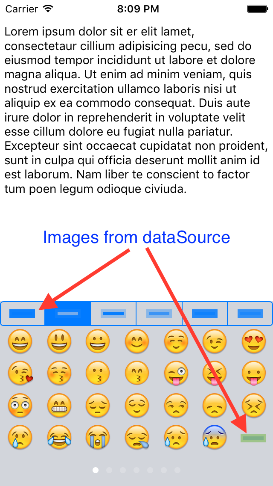

AGEmojiKeyboard
==================

[](http://cocoapods.org/pods/AGEmojiKeyboard)
[][CocoaDocsDocset]
[][CocoaDocsDocset]

An alternate keyboard for iOS that lets you display all the emojis supported by iOS.
Documentation is available via [CocoaDocs][CocoaDocsDocset].

Additions that need to be done:

1. Stickers
2. Custom emojis (different font)

## Example Project

To run the example project:

1. Clone the repo to a local folder.
2. Run `pod install` from the [Example][Example] directory.
3. Open `AGEmojiKeyboardSample.xcworkspace` placed in [Example][Example] folder.
4. Run.

-



## Installation

### Via CocoaPods

`AGEmojiKeyboard` is available through [CocoaPods](http://cocoapods.org), to install
it simply add the following line to your Podfile:

    pod "AGEmojiKeyboard"

### Copy the files

Copy the classes from [AGEmojiKeyboard/][AGEmojiKeyboard] and resources from [Resources/][Resources] to your project. Look at the [Example/][Example] folder to see how the classes are used for more detail.

## Usage

1. Use your own `ViewController` (optionally) to conform to [AGEmojiKeyboardViewDataSource][AGEmojiKeyboardViewDataSource] 
and [AGEmojiKeyboardViewDelegate][AGEmojiKeyboardViewDelegate] protocol.
2. Create an instance of [AGEmojiKeyboardView][AGEmojiKeyboardView] and set it as your `textView`'s `inputView`.

```objective-c
  CGRect keyboardRect = CGRectMake(0, 0, self.view.frame.size.width, 216);
  AGEmojiKeyboardView *emojiKeyboardView = [[AGEmojiKeyboardView alloc] initWithFrame:keyboardRect
                                                                           dataSource:self];
  emojiKeyboardView.autoresizingMask = UIViewAutoresizingFlexibleHeight;
  emojiKeyboardView.delegate = self;
  self.textView.inputView = emojiKeyboardView;
```

## Author

Ayush Goel, ayushgoel111@gmail.com

## License

AGEmojiKeyboard is available under the MIT license. See the [LICENSE][LICENSE] file for more info.

[Example]: Example/
[AGEmojiKeyboard]: AGEmojiKeyboard/
[Resources]: Resources/
[AGEmojiKeyboardViewDataSource]: http://cocoadocs.org/docsets/AGEmojiKeyboard/0.2.0/Protocols/AGEmojiKeyboardViewDataSource.html
[AGEmojiKeyboardViewDelegate]: http://cocoadocs.org/docsets/AGEmojiKeyboard/0.2.0/Protocols/AGEmojiKeyboardViewDelegate.html
[LICENSE]: LICENSE
[CocoaDocsDocset]: http://cocoadocs.org/docsets/AGEmojiKeyboard/
